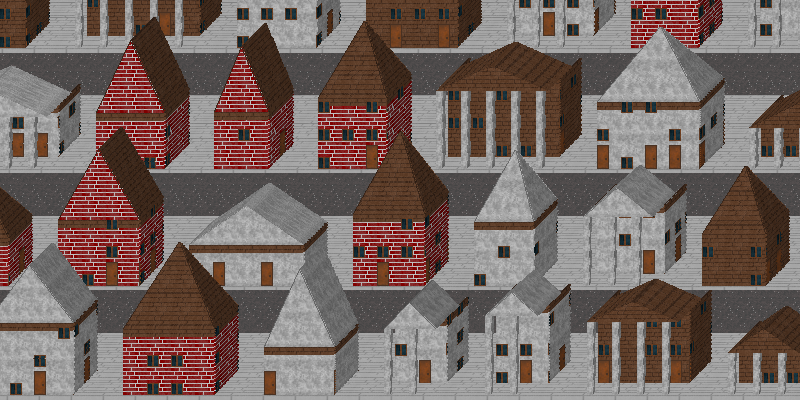

# Pixelopolis


*WARNING* - this code is 'very beta' - please dont be angry when something doesnt work `;_;`

## Howto install

```bash
make all
./pixelopolis
```

### Docker version (with web panel)

```bash
docker build . -t pixelopolis
docker run -it --rm -p 8000:80 pixelopolis
```

## Howto run (without docker)

```bash
./pixelopolis [CSS_IN_FILE] [PNG_OUT_FILE]
```

## CSS 

### Structure

Because we don't have XML/HTML, so we need make structure from CSS.

Actual structure:

```
body
└── draw-obj (cube, pyramid, series, filler, etc...)
    └── wall
        └── floor
            └── texture
```

### Schema

Pixelopolis has css-like syntax (not fully supported CSS2, *yet*)

#### Rule
```css
RULE {
    property: <OBJ>;
    property: <OBJ1> | <OBJ2>;
    property: <OBJ>;
    /* ... */
}
```

#### Selectors

```css
element { /*...properties...*/ }
element.class { /*...properties...*/ }
element.class1.class2 { /*...properties...*/ }
element:pseudo_class { /*...properties...*/ }
```

Sadly, parent operators are not supported :( - TODO

#### Property

##### Number

```css
rule { 
    number: 100;
    math: 100 * (2 + 2); /* mathematical operators are supported */
}
```

##### Percents

```css
rule { 
    full-percent: 100%;
    half-percent: 50%;
}
```

##### Selectors

```css
rule { 
    child: child-rule.child-class;
    another_child: child-rule;
    children: child-rule | child-rule.class | child-rule;
}
```

##### Functions
```css
rule { 
    random_number: random(0, 50); 
    random_obj: choice(obj1, obj2, obj3);
} 
```

### Body

The main element, required if you need run a program
```css
body {
    body: DRAW-OBJ-SELECTOR;
    width: NUMBER; /* width of output image */
    height: NUMBER; /* height of output image */
}
```

### DrawObj

#### Basic

#### Void

##### Cube

##### Triangle

##### Pyramid

#### Containers

##### Series

##### Filler

### Wall

### Floor

### Texture

## Contributors

* Firemark (forever alone)
