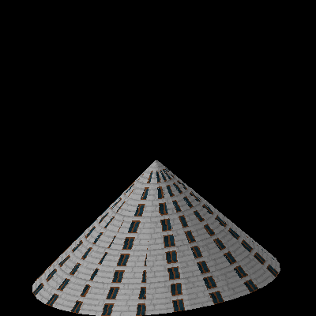

Cone
=====

Very fancy for tower's roof.

Properties
-----------

.. css:property:: display
    :type: cone
    :required:

.. css:property:: roof
    :type: SELECTOR-TO-WALL | null

.. css:property:: sides
    :type: INTEGER

    number of sides of cone. If have more sides then is more circular:

    .. figure:: images/cone-6-sides.png
        :alt: cone 6 sides

        6 sides

    .. figure:: images/cone-12-sides.png
        :alt: cone 12 sides

        12 sides

.. css:property:: has-many-walls
    :type: 1 | 0
    :default: 0

    :type 1: Render each side seperately
    :type 0: Render one wall stretched to whole area of cone

Example
--------

.. code-block:: scss

    roof {
        display: cone;
        width: 100;
        depth: 100;
        height: 100;

        roof: wall.roof;
        sides: 32;
    }

You can try in on https://pixelopolis.herokuapp.com/examples/Basic-shapes/Cone
