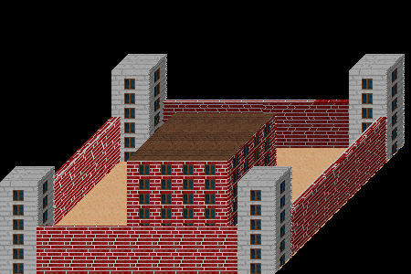

Square Fence
=============

Advanced container, has three type of objects: edges, corners and body (in the middle). Great for city walls, castles, greek-style columns, prisons or fence for cottage house.

Properties
-----------

.. css:property:: display
    :type: square-fence
    :required:

.. css:property:: body
    :type: SELECTOR-TO-DRAW-OBJ

    Links to draw-obj which be rendered in the center.

    .. figure:: images/square-fence-body.png
        :alt: Square fence body
        :figclass: align-center

        The body (blue)

.. css:property:: edge
    :type: SELECTOR-TO-DRAW-OBJ

    Links to draw-obj which be rendered in four edges.

    .. figure:: images/square-fence-edge.png
        :alt: Square fence edge
        :figclass: align-center

        Edges (blue)

.. css:property:: corner
    :type: SELECTOR-TO-DRAW-OBJ

    Links to draw-obj which be rendered in four corners.

    .. figure:: images/square-fence-corner.png
        :alt: Square fence corner
        :figclass: align-center

        Corners (blue)

.. css:property:: body-justify
    :type: JUSTIFY-X, JUSTIFY-Y | center | random
    :default: start, start

    align of body object.

    .. list-table::

        * - .. figure:: images/sf-body-justify-start.png
                :figclass: align-center

                justify: start, start

          - .. figure:: images/sf-body-justify-end.png
                :figclass: align-center

                justify: end, end

        * - .. figure:: images/sf-body-justify-center.png
                :figclass: align-center

                justify: center

          - .. figure:: images/sf-body-justify-random.png
                :figclass: align-center

                justify: random

        * - .. figure:: images/sf-body-justify-start-center.png
                :figclass: align-center

                justify: start, center

          - .. figure:: images/sf-body-justify-end-center.png
                :figclass: align-center

                justify: end, center

.. css:property:: edge-justify
    :type: start | end | center | random
    :default: start

    align of edge object.

    .. list-table::

        * - .. figure:: images/sf-edge-justify-start.png
                :figclass: align-center

                justify: start

          - .. figure:: images/sf-edge-justify-end.png
                :figclass: align-center

                justify: end

        * - .. figure:: images/sf-edge-justify-center.png
                :figclass: align-center

                justify: center

          - .. figure:: images/sf-edge-justify-random.png
                :figclass: align-center

                justify: random

.. css:property:: edge-size
    :type: INTEGER
    :default: 0

    depth (to the center of container) size of edge and corner.

Example
--------

.. code-block:: scss

    prison {
        display: square-fence;
        width: 500;
        depth: 500;

        body: building;
        edge: fence;
        corner: tower;

        body-justify: center;
        edge-size: 40;
    }

You can try on https://pixelopolis.herokuapp.com/examples/Containers/Square-Fence
