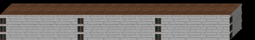
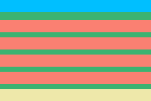

Wall
=====

Image put on the side in basic shape. Wall can have floors, background and particles

Description of properties
--------------------------

* *Green* - texture (background)
* *Blue* - top floor
* *Red* - middle floor
* *Bottom* - bottom floor

Properties
-----------

.. css:property:: texture
    :type: TEXTURE-SELECTOR
    :default: null

    links to texture as background

.. css:property:: padding
    :type: INTEGER
    :default: 0

    padding between middle floors.

.. css:property:: middle
    :type: FLOOR-SELECTOR
    :default: null

    Links with floor selector.

.. css:property:: top
    :type: FLOOR-SELECTOR
    :default: null

    Links with floor selector and render only on top of wall. Ignores paddings and align

.. css:property:: bottom
    :type: FLOOR-SELECTOR
    :default: null

    Links with floor selector and render only on bottom of wall. Ignores paddings and align
