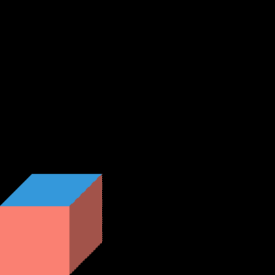

Hello cube
================

In first time, It would be great to create own cube. Cubes have a ideal shape and are very friendly for environment and your friends!

Our cube should be like as:

The code is very simillar to CSS code - if don't know about website styles, we have a super-shorcut syntax: (:ref:`articles/schema/index:Schema`)

.. code-block:: scss

    rule {
        param: value; /* comment */
    }

    another-rule.class-name {
        param: value;
    }

So, at first we need to create *the world*, it's a main rule who describe sizes and first rendered object:

.. code-block:: scss

    world {
        width: 400;           /* width of image in pixels */
        height: 400;          /* height of image in pixels */
        body: my-little-cube; /* first element to rendered at position (0, 0, 0) */
        /* yep - our world is 3d rendered in Cavalier projection. */
    }

When we have the world, then we can describe our cube:

.. code-block:: scss

    my-little-cube {
        display: cube;   /* we need to write a type of draw-object. */
        wall: wall.wall; /* link to another element which describes color of wall */
        roof: wall.roof; /* this same like above, but describes color of roof */

        /* Size of cube */
        width: 100;
        depth: 100;
        height: 100;
    }

Now, we need to describe wall-objects for walls and roof.

Each wall can have texture (as background) and floor-objects (It will be about this in next step).

For now, wall and roof will have named textures:

.. code-block:: scss

    wall.wall { texture: tex.salmon; }
    wall.roof { texture: tex.blue; }

And we need textures of solid colors for wall-objects:

.. code-block:: scss

    /* you can generate colors in hexs here:
       ttps://htmlcolorcodes.com */
    tex.salmon { color: #FA8072; } /* nice salmon color */
    tex.blue { color: #3498DB; }   /* BLUE COLOR OMG! */

And done! Of course, it's a your cube - you can change colors, and size. If you don't like the cube (how could you?!), you can change shape (:ref:`articles/elements/basic-shapes/index:Basic Shapes`)

The final code should be like this:

.. code-block:: scss

    world {
        width: 400;
        height: 400;
        body: my-little-cube;
    }

    my-little-cube {
        display: cube;
        wall: wall.wall;
        roof: wall.roof;

        width: 100;
        depth: 100;
        height: 100;
    }

    wall.wall { texture: tex.salmon; }
    wall.roof { texture: tex.blue; }

    tex.salmon { color: #FA8072; }
    tex.blue { color: #3498DB; }

You can try it online: https://pixelopolis.herokuapp.com/examples/Tutorial/Hello-Cube

On the next tutorial, I will describe about floor and textures: (:ref:`articles/tutorial/textures:Textures`)

