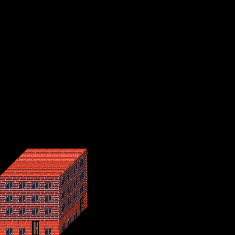

Textures
================

In the previous tutorial (:ref:`articles/tutorial/hello-cube:Hello Cube`) we made a pretty cube.
But we know, solid colors is not enough. In this step, we try to add windows and doors.

Our cube should be like as:

In this step, we need code from previous tutorial (:ref:`articles/tutorial/hello-cube:Hello Cube`), but instead solid colors, we need to change walls.

.. code-block:: scss

    wall.wall {
        texture: tex.brick; /* background of wall will be brick */
        middle: floor.windows; /* floors will have windows */
        bottom: floor.doors-and-windows; /* zero floor will have doors and windows */
        padding: 10;
    }

    wall.roof {
        texture: tex.roof; /* just only roof texture */
    }

Ok, so we add floor-objects, so we need to add rules with floors:

.. code-block:: scss

    floor.windows {
        middle: tex.window; /* texture of object */
        align: center; /* all windows will be aligned to center */
        height: 12; /* height of the floor */
        padding: 10; /* padding between windows */
    }

    floor.doors-and-windows {
        texture: tex.roof; /* floor can have a background too */
        middle: choice(tex.window, tex.window, tex.door); /* this function randomly chooses window, window or door. */
        padding: 10; /* padding between objects on the floor */
    }

And we need to describe textures:

.. code-block:: scss

    tex.window { texture: "textures/wall-objs/window.png"; }
    tex.door { texture: "textures/wall-objs/door.png"; }
    tex.brick { texture: "textures/wall/brick.png"; }
    tex.roof { texture: "textures/wall/red-tile.png"; }

And is enough to show better cube. The final code should be like this:

.. code-block:: scss

    world {
        width: 400;
        height: 400;
        body: my-little-cube;
    }

    my-little-cube {
        display: cube;
        wall: wall.wall;
        roof: wall.roof;

        width: 100;
        depth: 100;
        height: 100;
    }

    wall.wall {
        texture: tex.brick;
        middle: floor.windows;
        bottom: floor.doors-and-windows;
        padding: 10;
    }

    wall.roof {
        texture: tex.roof;
    }

    floor.windows {
        middle: tex.window;
        align: center;
        height: 12;
        padding: 10;
    }

    floor.doors-and-windows {
        texture: tex.roof;
        middle: choice(tex.window, tex.window, tex.door);
        padding: 10;
    }

    tex.window { texture: "textures/wall-objs/window.png"; }
    tex.door { texture: "textures/wall-objs/door.png"; }
    tex.brick { texture: "textures/wall/brick.png"; }
    tex.roof { texture: "textures/wall/red-tile.png"; }

You can try it online: https://pixelopolis.herokuapp.com/examples/Tutorial/Textures
